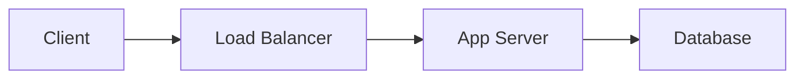
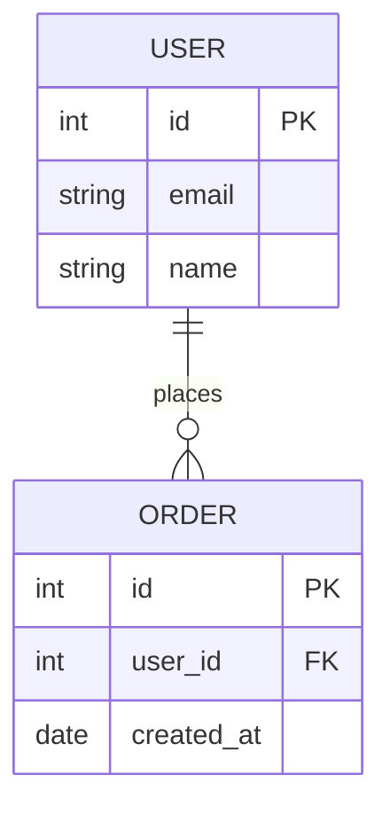
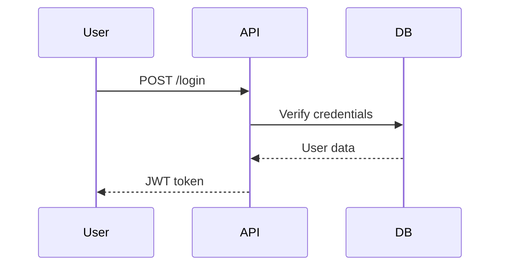
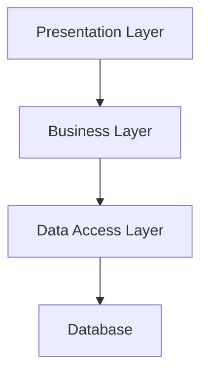

# Règles de Documentation Technique - Version Améliorée

## 📋 Structure obligatoire

### Sections principales (ordre à respecter)

#### 1. 📋 Vue d'ensemble ⭐⭐⭐
- Description du projet (2-3 phrases)
- Objectif principal
- Public cible

#### 2. ✨ Caractéristiques principales ⭐⭐⭐
- 5-7 fonctionnalités clés
- Points différenciants

#### 3. 🔧 Stack technique ⭐⭐⭐
- Backend (langage, framework, version)
- Frontend (framework, bibliothèques)
- Base de données (type, version)
- Infrastructure (Docker, K8s, etc.)
- Outils de build/CI/CD

#### 4. 🏗️ Architecture du projet ⭐⭐⭐

##### 4.1 Type d'architecture
- Identifier: MVC, DDD, CQRS, Hexagonal, Layered, Microservices
- Pas de justification de choix

##### 4.2 Structure des dossiers
- Arborescence complète (2-3 niveaux)
- Description de chaque dossier principal

##### 4.3 Base de données
- **MCD complet** (Mermaid ERD obligatoire)
- Liste des tables avec description
- Relations principales
- Index importants
- Note: Se baser sur les fichiers Entity si Symfony/Doctrine

##### 4.4 Diagrammes d'architecture
- Architecture système (Mermaid)
- Architecture applicative (Mermaid)
- Flux de données principaux (3-5 diagrammes)

#### 5. 🔐 Authentification et sécurité ⭐⭐
- Mécanisme d'authentification
- Gestion des sessions/tokens
- Rôles et permissions
- Mesures de sécurité appliquées
- Vulnérabilités connues (si applicable)

#### 6. 📡 API et Endpoints ⭐⭐
- Liste des endpoints principaux
- Format de requête/réponse
- Authentification API
- Exemples d'utilisation (cURL)
- Rate limiting (si applicable)

#### 7. ⚙️ Configuration ⭐⭐⭐
- Fichiers de configuration
- Variables d'environnement (.env)
- Configuration par environnement (dev/staging/prod)

#### 8. 🚀 Installation et déploiement ⭐⭐⭐
- Prérequis
- Installation locale (étape par étape)
- Déploiement (dev/staging/prod)
- Vérification de l'installation

#### 9. 🐳 DevOps / Docker ⭐⭐
- Services Docker
- Volumes et réseaux
- Commandes utiles
- Troubleshooting

#### 10. ⏰ Tâches CRON ⭐
- Liste des tâches planifiées
- Fréquence et horaires
- Description de chaque tâche
- Logs et monitoring

#### 11. 👨‍💼 Interface d'administration ⭐
- Accès (URL, credentials par défaut)
- Modules disponibles
- Rôles et permissions

#### 12. 📝 Conventions de code ⭐⭐
- Style de code (PSR, ESLint, etc.)
- Nommage (variables, fonctions, classes)
- Structure des fichiers
- Commentaires

#### 13. 🔀 Gitflow ⭐⭐
- Branches principales
- Convention de nommage des branches
- Convention des commits
- Processus de merge/release

#### 14. 🐛 Debugging ⭐⭐
- Logs (localisation, format)
- Outils de debug
- Commandes utiles
- Problèmes courants et solutions

#### 15. 📊 Monitoring ⭐
- Outils de monitoring (Sentry, Datadog, etc.)
- Métriques surveillées
- Alertes configurées
- Dashboards

#### 16. 🔑 Accès ⭐⭐
- URLs (dev, staging, prod)
- Comptes par défaut
- VPN/Bastion (si nécessaire)
- Accès aux services tiers

#### 17. 🧪 Tests ⭐
- Types de tests (unitaires, intégration, e2e)
- Comment lancer les tests
- Coverage actuel
- Stratégie de tests

#### 18. ⚡ Performance ⭐
- Métriques clés (temps de réponse, throughput)
- Optimisations appliquées
- Limites connues
- Recommandations

#### 19. 📦 Dépendances ⭐
- Dépendances principales (avec versions)
- Dépendances de développement
- Stratégie de mise à jour
- Dépendances critiques

#### 20. 🎯 Glossaire ⭐
- Termes métier
- Acronymes
- Termes techniques spécifiques

---

## 📐 Format des diagrammes

### Obligatoire: Mermaid

#### Architecture système


#### MCD (Entity Relationship Diagram)


#### Flux / Séquence


#### Architecture applicative


---

## 📂 Décomposition de la documentation

### Structure des fichiers

```
docs/
├── INDEX.md                    # Table des matières avec liens
├── QUICK_START.md              # Installation rapide (< 10 min)
├── 01_VUE_ENSEMBLE.md
├── 02_STACK_TECHNIQUE.md
├── 03_ARCHITECTURE.md
├── 04_BASE_DONNEES.md          # Avec MCD Mermaid
├── 05_SECURITE.md
├── 06_API_ENDPOINTS.md
├── 07_CONFIGURATION.md
├── 08_INSTALLATION.md
├── 09_DOCKER.md
├── 10_CRON.md
├── 11_ADMINISTRATION.md
├── 12_CONVENTIONS_CODE.md
├── 13_GITFLOW.md
├── 14_DEBUGGING.md
├── 15_MONITORING.md
├── 16_ACCES.md
├── 17_TESTS.md
├── 18_PERFORMANCE.md
├── 19_DEPENDANCES.md
└── 20_GLOSSAIRE.md
```

### Convention de nommage
- Préfixe numérique (ordre logique)
- Snake_case
- Nom explicite
- Extension .md

---

## ❌ Ce qui ne doit PAS être présent

### Exclusions strictes
- ❌ Points d'amélioration / TODO / Roadmap
- ❌ Guide de contribution (fichier séparé: CONTRIBUTING.md)
- ❌ Historique détaillé des changements (utiliser Git)
- ❌ Code commenté ligne par ligne
- ❌ Captures d'écran (sauf si vraiment nécessaire)
- ❌ Informations sensibles (mots de passe, clés API)
- ❌ Opinions personnelles
- ❌ Blagues ou contenu non professionnel

### À éviter
- ⚠️ Diagrammes en ASCII (utiliser Mermaid)
- ⚠️ Liens externes non vérifiés
- ⚠️ Exemples non testés
- ⚠️ Documentation obsolète

---

## ✅ Critères de qualité

### Checklist de validation
- [ ] Toujours en francais
- [ ] Tous les diagrammes sont en Mermaid
- [ ] MCD complet de la base de données
- [ ] Chaque section a des exemples concrets
- [ ] Toutes les commandes sont testées
- [ ] Pas de liens morts
- [ ] Orthographe et grammaire vérifiées
- [ ] Navigation < 5 min pour trouver une info
- [ ] INDEX.md à jour avec tous les liens
- [ ] QUICK_START.md permet installation en < 10 min
- [ ] Pas d'informations sensibles
- [ ] Format Markdown valide
- [ ] Cohérence entre les fichiers

### Niveaux de priorité

| Symbole | Priorité | Description |
|---------|----------|-------------|
| ⭐⭐⭐ | Obligatoire | Doit être présent et complet |
| ⭐⭐ | Important | Doit être présent si applicable |
| ⭐ | Optionnel | Présent si pertinent pour le projet |

---

## 📏 Standards de rédaction

### Style
- Phrases courtes et claires
- Voix active
- Présent de l'indicatif
- Exemples concrets
- Pas de jargon inutile

### Format
- Titres avec emojis pour navigation visuelle
- Blocs de code avec syntaxe highlighting
- Tableaux pour comparaisons
- Listes à puces pour énumérations
- Liens internes entre sections

### Exemples
```markdown
✅ Bon:
## 🚀 Installation
Pour installer le projet, exécutez:
```bash
npm install
```

❌ Mauvais:
## Installation
Il faut que vous installiez les dépendances.
```

---

## 🔄 Maintenance

### Mise à jour
- Après chaque modification majeure d'architecture
- Après ajout de fonctionnalités importantes
- Après changement de stack technique
- Minimum: revue trimestrielle

### Responsabilité
- Tech Lead: Validation de la structure
- Développeurs: Mise à jour de leur domaine
- DevOps: Sections infrastructure
- Architecte: Diagrammes et architecture

---

## 📚 Ressources

### Outils recommandés
- **Éditeur Markdown**: VS Code, Typora
- **Diagrammes**: Mermaid Live Editor
- **Validation**: markdownlint
- **Preview**: GitHub/GitLab preview

### Références
- [Mermaid Documentation](https://mermaid.js.org/)
- [Markdown Guide](https://www.markdownguide.org/)
---

**Version**: 2.0  
**Date**: 2025-12-04  
**Auteur**: Documentation Standards
